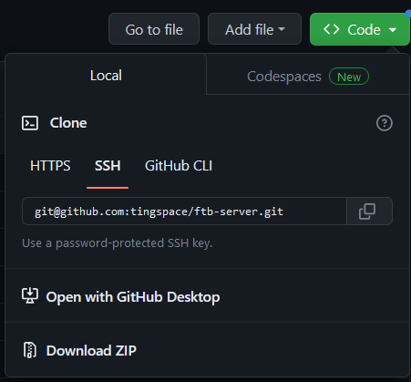

# FTB Infinity Evolved v1.7.10 w/Galacticraft

A pre-packaged FTB server with a pre-generated world that can be swapped out.

This server is made up of:
- [Feed The Beast Infinity Evolved Modpack](https://feed-the-beast.com/modpacks/23-ftb-infinity-evolved-17)
- [Galacticraft](https://micdoodle8.com/mods/galacticraft/) (v1.7.10)

# How to download

In GitHub, click the `Code` dropdown and then click `Download ZIP`.

# Running the server

If you're running on a Windows Machine, the server should come with everything it needs. You shouldn't need to install anything.

Just go through these steps...

1. Open this folder in Command Prompt or PowerShell
2. Run `.\start.bat`
3. Profit???

## Using your own world

The `world` folder is pre-generated and un-tainted by player filth. To use your own world, you just need to replace the files & folders in `world` with what you have.

The steps if you forget:

1. Rename the folder to the Server name so you remember what it is.
2. Open the `world` folder and delete it's contents.
3. Replace the folder with the world files & folders you have from your save.
4. Profit???

## Generating a new world

You probably already know what to do, but it's here if we both forget.

Steps:

1. Delete the `world` folder entirely.
2. If you have a seed you want to use, open the `server.properties` file in a text editor (Like Notepad)
3. Re-run the server to begin generating the new files.

